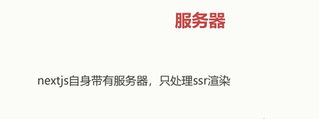
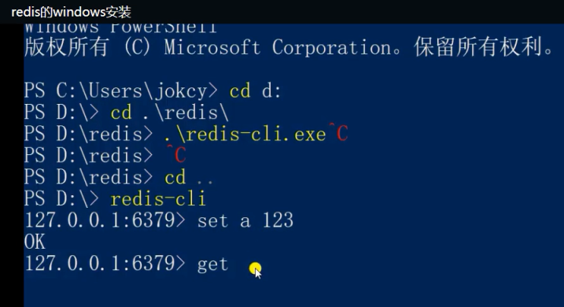

# 课程

## 导学

nextjs koa oauth


版本号的作用：`^1.01`加了尖括号是表示只会升级小版本，不会升级大版本

https://github.com/sl1673495/next-github/tree/init

- ##### 第1章 课程导学

  对课程整体进行介绍，让您切实感受到前端工程师学习的必要性。

  -  1-1 课程导学**试看**

- 

  ##### 第2章 项目搭建

  讲解 Nextjs 项目的搭建，其中会搭建自己的服务集成 Koa，集成 Antd 作为组件库。本章中还讲解了 Redis 在 Windows 和 Mac 系统上的安装和启动，讲解了 Redis 的基础使用，以及如何在 Nodejs 中连接 Redis 数据库。

  -  2-1 关于项目所用的npm包版本号
  -  2-2 创建next.js的项目

  有两种，npm init 安装next这个依赖，加script语句

  

  

  在next里面，不用import react

  来编写jsx的语言，因为，next在全局中处理过了，有这个

  react react-dom next

  第二种用create-next-app

  npx方便运行单独的依赖包

  > npx 想要解决的主要问题，就是调用项目内部安装的模块。比如，项目内部安装了测试工具 [Mocha](http://www.ruanyifeng.com/blog/2015/12/a-mocha-tutorial-of-examples.html)。
  >
  > > ```bash
  > > $ npm install -D mocha
  > > ```
  >
  > 一般来说，调用 Mocha ，只能在项目脚本和 package.json 的[`scripts`](http://www.ruanyifeng.com/blog/2016/10/npm_scripts.html)字段里面， 如果想在命令行下调用，必须像下面这样。
  >
  > > ```bash
  > > # 项目的根目录下执行
  > > $ node-modules/.bin/mocha --version
  > > ```
  >
  > npx 就是想解决这个问题，让项目内部安装的模块用起来更方便，只要像下面这样调用就行了。
  >
  > > ```bash
  > > $ npx mocha --version
  > > ```
  >
  > npx 的原理很简单，就是运行的时候，会到`node_modules/.bin`路径和环境变量`$PATH`里面，检查命令是否存在。
  >
  > 由于 npx 会检查环境变量`$PATH`，所以系统命令也可以调用。
  >
  > > ```bash
  > > # 等同于 ls
  > > $ npx ls
  > > ```
  >
  > 注意，Bash 内置的命令不在`$PATH`里面，所以不能用。比如，`cd`是 Bash 命令，因此就不能用`npx cd`。

  1，全局安装： npm i -g create-next-app

  ****

  -  2-3 next作为koa中间件使用

  

  

  -  2-4 koa使用方式介绍
  -  2-5 redis的windows安装

  

  

  -  2-6 redis的mac安装
  -  2-7 redis基本使用
  -  2-8 nodejs连接redis数据库
  -  2-9 nextjs集成antd

- 

  ##### 第3章 Next.js基础

  从目录结构开始逐步解析 Nextjs 的使用方法，在这章里，你能学到 Nextjs 的路由技巧，服务端渲染数据获取的方式，以及如何同步客户端渲染和服务端渲染的方式。同时我们还会深入 Nextjs 讲解如何自定义 App 和 Document 组件，以及集成第三方 css-in-js 的方法。...

  -  3-1 nextjs项目目录结构
  -  3-2 页面跳转
  -  3-3 动态路由
  -  3-4 路由映射
  -  3-5 路由变化的钩子
  -  3-6 nextjs数据获取方式
  -  3-7 nextjs自定义App
  -  3-8 nextjs自定义Document
  -  3-9 nextjs样式的定义
  -  3-10 nextjs集成styled-components
  -  3-11 nextjs中异步模块和组件的加载
  -  3-12 nextjs中的配置项
  -  3-13 nextjs服务端渲染流程深度解析**试看**

- 

  ##### 第4章 React新特性Hooks讲解

  本章讲解 React 的最新爆点功能：Hooks。我们会介绍什么是 Hooks，基础 Hooks 的使用，包括 State Hooks，Effect Hooks、Context Hooks 和优化相关的 Hooks。然后我们会结合经典实例讲解在 Hooks 的使用中会遇到的问题，以及我们如何解决他。

  -  4-1 什么是Hooks**试看**
  -  4-2 State-Hooks讲解
  -  4-3 Effect-Hooks讲解
  -  4-4 Context-Hooks讲解
  -  4-5 Ref-Hook讲解
  -  4-6 Hooks渲染优化
  -  4-7 闭包陷阱

- 

  ##### 第5章 引入Redux

  我们会介绍 Redux 的使用。Redux 是现在非常火热的数据状态管理工具，也是 Flux 数据流最好的实现，现在的 React 开发中非常常用。同时我们会着重介绍 Redux 如何集成到 Nextjs 当中，这其中需要考虑服务端渲染数据同步的问题，我们会在课程中深度介绍。...

  -  5-1 什么是Redux
  -  5-2 创建一个store
  -  5-3 redux中的reducer
  -  5-4 redux中的action
  -  5-5 react-redux连接react和redux
  -  5-6 redux-devtool的使用
  -  5-7 nextjs中的HOC
  -  5-8 nextjs集成redux（1）
  -  5-9 nextjs集成redux（2）

- 

  ##### 第6章 OAuth 介绍和接入

  我们围绕着 OAuth 第三方授权协议进行讲解。我们会介绍什么是 OAuth、他存在的意义、他的安全性、以及接入 OAuth 的流程。然后配合 Github OAuth 进行实战演练，在这个过程中我们还会实现 session 功能，并将 session 数据存入 Redis。

  -  6-1 认证和授权介绍
  -  6-2 OAuth概述
  -  6-3 code认证方式的流程
  -  6-4 注册github-OAuth-App
  -  6-5 OAuth的字段讲解以及流程演示
  -  6-6 OAuth-code认证方式如何保证安全
  -  6-7 cookie 和 session
  -  6-8 创建koa-seesion的redis存储store（1）
  -  6-9 创建koa-seesion的redis存储store（2）
  -  6-10 接入Github-OAuth（1）
  -  6-11 接入Github-OAuth（2）

  ##### 第7章 项目整体设计

  讲解项目内容整体的设计，包括页面整体布局，项目数据 API 代理，功能性组件的开发等。在项目正式开始页面开发之前，做好基础设施是提高开发效率的最好方法。

  -  7-1 项目整体需求介绍
  -  7-2 页面整体布局Layout组件的开发
  -  7-3 cloneElement扩展组件可复用性的高级技巧
  -  7-4 服务端渲染同步用户信息
  -  7-5 完善登录功能
  -  7-6 用户登出功能实现
  -  7-7 维持OAuth之前得页面访问
  -  7-8 增加全局页面切换的Loading效果
  -  7-9 Github接口代理
  -  7-10 完善整体布局
  -  7-11 Github接口代理完善
  -  7-12 koa中处理post请求的数据

  ##### 第8章 首页开发

  本章我们进行首页开发，主要包括获取用户自己创建的仓库，star 的仓库列表，并进行 Tab 切换展示。在这个过程中我们会开发一个通用的仓库展示组件，还会设计一个数据缓存方案，使用 LRU 方案进行 cache。

  -  8-1 联调主页数据
  -  8-2 展示用户数据以及用户登出时的页面内容
  -  8-3 Repo组件展示基本组件内容的开发
  -  8-4 tab切换展示创建的仓库和关注的仓库
  -  8-5 使用缓存数据
  -  8-6 使用缓存更新策略

- 

  ##### 第9章 搜索页面开发

  本章我们进行搜索页面的开发，搜索页面会拥有很多的删选条件，我们要把这些条件反应到 URL 上，并且保存搜索记录，以带来更好的用户体验。同时我们会对搜索进行分页展示。

  -  9-1 搜索功能概述
  -  9-2 搜索接口联调以及搜索条件展示
  -  9-3 搜索条件删选功能实现
  -  9-4 搜索条件跳转的优化-提取组件
  -  9-5 搜索结果的展示
  -  9-6 处理Github搜索结果限制

- 

  ##### 第10章 仓库详情页开发

  本章我们进行仓库详情页的开发。不管是在个人页面还是搜索页面，点击仓库都可以进入仓库详情页面，在这里我们可以查看仓库的介绍信息，以及仓库现存的 Issue 列表，我们还以点击查看 Issue 详情。

  -  10-1 仓库详情页面功能概述
  -  10-2 仓库布局开发
  -  10-3 提取布局成为一个HOC
  -  10-4 仓库基础信息缓存功能的实现
  -  10-5 获取markdown内容并转义
  -  10-6 使用markdown-it来转换markdown
  -  10-7 打包分析
  -  10-8 issues页面的开发
  -  10-9 创建用户搜索组件
  -  10-10 完成issue搜索功能的开发
  -  10-11 完善issues页面

- 

  ##### 第11章 项目优化

  最后一章我们讲解 Nextjs 项目的一些优化方式。包括如何将项目静态化，如何在编译的过程中优化配置，让编译之后的文件更符合上线要求等。

  -  11-1 nextjs静态页面导出功能
  -  11-2 项目部署
  -  11-3 总结